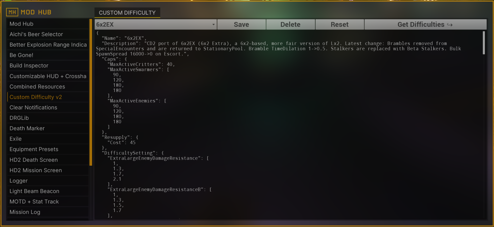

# The basics of CD2

## The CD2 GUI

CD2 features a simple GUI compatible with both ModHub and UUI:

<figure markdown="span">
  
  <figcaption>Main CD2 screen in Modhub.</figcaption>
</figure>

The files for your difficulties can be pasted and edited in the text box. After clicking `Save`, the file will be saved based on the name in the `Name` top level field; if the file already existed, it will be overwritten. Difficulties get saved inside your mod config. You can check all your difficulties by clicking on the drop-down menu.

The `Reset` button sets a difficulty as a default upon starting the game.

## The CD2 files 

* CD2 files are in the [JSON](https://en.wikipedia.org/wiki/JSON) format.
* CD1 files are not compatible with CD2.
* The top level fields of the file are [modules](modules.md) with different functionalities.
* If a module or a field is missing from a CD2 file, the value from the `BaseHazard` for the file is taken. The `BaseHazard` can be specified inside the `DifficultySetting` module. If none is specified, the base hazard is Hazard 5. 
* A file that is just `{}` represents vanilla Hazard 5. 
* Most fields that admit floats or ints accept also an array of the same type:

```json
{
    "Caps": {
        "MaxActiveEnemies": [90, 120, 180, 180]
    }
}
```

which means that `MaxActiveEnemies` scales with the number of players, 1 to 4, with the values specified inside. The arrays can be as large as desired to accomodate for 4+ player lobbies:

```json
{
    "Caps": {
        "MaxActiveEnemies": [90, 120, 180, 180, 210, 210, 240, 240]
    }
}
```

If the lobby has more players than indices in the array, the last value is used.

* Most fields can change based on gameplay conditions using [mutators](mutators.md). The best way to learn how to use them is to look at already existing difficulties and trying to understand what they do.

The following is a very simple file for Hazard 5x2, that is, vanilla Hazard 5 with double enemies and a 60 nitra resupply cost:

```json 
{
  "Name": "Hazard 5x2",
  "Caps": {
    "MaxActiveSwarmers": [ 90, 120, 180 ],
    "MaxActiveEnemies": [ 90, 120, 180 ]
  },
  "Resupply": {
    "Cost": 60
  },
  "DifficultySetting": {
    "BaseHazard": "Hazard 5",
    "EnemyCountModifier": [ 1.7, 1.7, 2.5, 3 ]
  }
}
```


