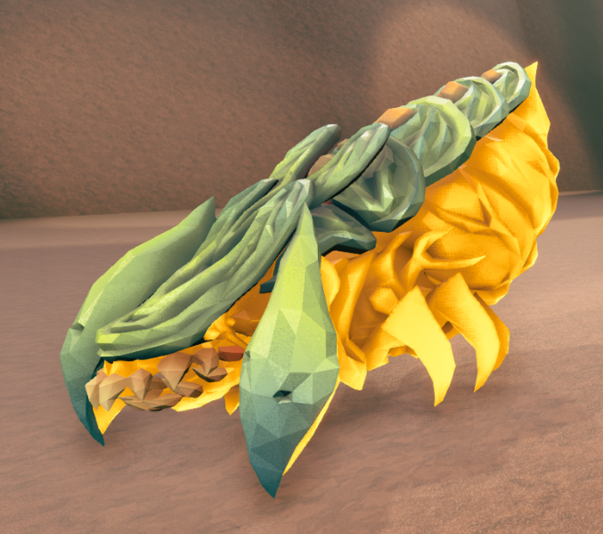

# Enemies / EnemiesNoSync
This module contains the enemy descriptors. The difficulty can only contain either the `Enemies` module or `EnemiesNoSync`: 

* `Enemies` can replicate some enemy characteristics to players, such as materials and scale, but in exchange it forces the clients to use CD2 or they will suffer a disconnect upon mission start. 
* `EnemiesNoSync` doesn't do replication to clients. A difficulty with `EnemiesNoSync` is compatible with all clients, regardless of whether they use CD1, CD2 or nothing at all. 

## Descriptor controls 

| Name                           | Type    |
| ------------------------------ | ------- |
| CanBeUsedForConstantPressure   | Boolean |
| CanBeUsedInEncounters          | Boolean |
| CustomVeterans                 | See `Veteran control` below. |
| DifficultyRating               | Float   |
| MaxSpawnCount                  | Int     |
| MinSpawnCount                  | Int     |
| Rarity                         | Float   |
| Significance                   | String, takes ("Swarmer", "Normal", "Critical", "Critter") |
| SpawnAmountModifier            | Float   |
| SpawnRarityModifiers           | *       |
| SpawnSpread                    | Float   |
| UsesSpawnRarityModifiers       | Boolean |
| UsesVeteranLarge               | See `Veteran control` below. |
| VeteranClasses                 | See `Veteran control` below. |

## Enemy controls
Fields inside [[]] are special submodules that can be found in the sections that follow.

| Name                      | Type            | Comments |
| ------------------------- | --------------- | --------- |
| Alert                     | Boolean         | If True, the enemy will spawn aggroed to the player. It is True by default in enemies spawned by a [wave spawner](wavespawners.md). |
| CanPlayerStandOn          | Boolean         |  |
| CaveLeech                 | [[CaveLeech]]   | See the `CaveLeech` module below for special Cave Leech controls. |
| Courage                   | Float           | |
| Direct                    | [Int, Float, Bool, Pcol] | Special control that can expose enemy properties (see example below). |
| DisplayName               | String          | |
| Elite                     | Float \| Bool         | This field accepts a float number indicating the percentage of Elite enemies that will spawn for that descriptor. |
| EnemyHealthScaling        | String          | |
| ForceEliteBase            | ED              | See `Elite variants for all enemies` below. |
| Grabber                   | [[Grabber]]     | See the `Grabber` module below for special Grabber controls. |
| IsBossFight               | Boolean         | If True, the enemy will have a boss bar in the player UI similar to the vanilla dreadnoughts. The name in the bar will be the descriptor's `DisplayName`. |
| JellyBreeder              | [[JellyBreeder]] | See the `JellyBreeder` module below for special breeder controls. |
| Heal                      | Float           | A positive number `N` will heal the enemy `N` hps. A negative number will do `N` dps to the enemy. |
| HealthMultiplier          | Float           | |
| HealthRaw                 | Float           | |
| Materials                 | [[Materials]]   | A list of UE4 materials that will be applied to different parts of the enemy. Each enemy is different with regard to how many materials will it accept and how will they be applied, so trial and error is usually needed to get the expected results. |
| MEV                       | Special         | |
| Movement                  | [[Movement]]    | See the `Movement` submodule below. |
| NoSpawnWithin             | Float            | Removes enemies that spawn within the specified distance of the player, in cm. |
| Projectile                | [[Projectile]]  | See [Projectiles](projectiles.md). |
| Resistances               | [[Resistances]] | See the `Resistances` submodule below. |
| Scale                     | Float           | |
| Spawner                   | [[Spawner]]     | See `Spawners` below. |
| ShowHealthBar             | Boolean         | |
| StaggerImmunityWindow     | Float           | |
| StaggerDurationMultiplier | Float           | |
| Temperature               | [[Temperature]] | See the `Temperature` submodule below. |
| TimeDilation              | Float           | Speeds up the enemy's attack and movement. Please note that time-dilating enemies can be a source of desync. |
| UsesBiomeVariants         | Boolean           | Enables/disables the biome variants of enemies (eg. Frost Praetorian in Glacial Strata). |
| WeakpointHP               | Float           | |

### `Direct` special control 

`Direct` allows to directly change enemy properties as defined in UE4. For example:

```json
"ED_Spider_ExploderTank": {
    "Direct": {
        "Int:NumClusterBombs": 200 
    }
}
```

```json 
"ED_Spider_Exploder": {
  "Movement": {
    "MaxPawnSpeed": 5,
    "MaxAcceleration": 5,
    "MaxBrakingDeceleration": 10,
    "AlignDirectionSpeed": 10,
    "AlignToTargetMinRequiredAngle": 1,
    "StrafeSpeed": 5
  },
  "Direct": {
    "PCol:Mesh": true
  },
  "CanPlayerStandOn": true,
  "Alert": true
}
```

```json 
"ED_JellyBreeder": {
  "Direct": {
    "Bool:Capsule.bHiddenInGame": false,
    "PCol:Capsule": true
  },
  "CanPlayerStandOn": true
}
```

### Elite variants for all enemies

Setting `Elite` to true or to some float number will only work directly for those enemies that have a vanilla elite variant: guards, grabbers, praetorians, bulks, menaces and trijaws. For the rest of the enemies, an elite base must be specified by setting `ForceEliteBase` to some existing ED that has an elite variant. As an example, the following snippet creates an elite septic spreader, which won't work without the `ForceEliteBase`:

```json
"ED_Elite_Septic_Spreader": {
    "Base": "ED_Spider_Lobber",
    "Elite": true,
    "ForceEliteBase": "ED_Grabber"
}
```

The type of elite specified as base can modify the characteristics of your custom elite descriptor, feel free to experiment. 

### Veteran control 

Veterans allow some enemies to promote to other enemies. In vanilla the veteran classes are hardcoded (for example, oppressors are praetorians that got promoted with a probability given by the `VeteranLarge` setting in [DifficultySetting](modules.md)). CD2 improves the system by allowing the player to create their own custom veteran classes. There are currently two ways to interact with the veteran system:

* `VeteranClasses` accepts a list of descriptors that the base descriptor can promote to. `VeteranClasses` uses `VeteranNormal` probablities unless `UsesVeteranLarge` is set to true. The following snippet shows an example:

```json
"DifficultySetting": {
    "VeteranNormal": {
        [
        "Weight": 1,
        "Min": 0.2, 
        "Max": 0.2
        ]
    }
},
"Enemies": {
    "ED_Spider_Grunt": {
        "VeteranClasses": [
            "ED_Spider_Shooter",
            "ED_Spider_Spitter"
        ]
    }
}
```

With these settings, Grunts will promote to acid and web spitters with a 20 % chance each time they spawn. One disadvantage of this approach is that `VeternalNormal` and `VeteranLarge` are global.

* The second way is `CustomVeterans`, which bypasses the `VeternalNormal` and `VeteranLarge` settings and lets the user specify the probability directly. The following snippet whould work exactly as the one before, but now the probabilities are contained to the grunt descriptor instead of being global:

```json
"ED_Spider_Grunt": {
     "CustomVeterans": {
        "ED_Spider_Grunt": 0.8,
        "ED_Spider_Shooter": 0.1,
        "ED_Spider_Spitter": 0.1
      }
    }
```

`CustomVeterans` also allows specifying a mutator to decide which enemies to spawn, which can give more control. One useful use case is to limit the amount of veterans of a certain type:

```json 
"ED_Spider_Grunt": {
      "CustomVeterans": {
        "Mutate": "RandomChoice",
        "Choices": [ "ED_Spider_Buffer", "ED_Spider_Grunt", "ED_Spider_Grunt_Guard", "ED_Spider_Grunt_Attacker" ],
        "Weights": [
          {
            "Mutate": "IfFloat",
            "Value": { "Mutate": "EnemyCount", "ED": "ED_Spider_Buffer" },
            "<": 5,
            "Then": 30,
            "Else": 0
          },
          1,
          1,
          1
        ]
      }
    },
```

This snippet gives a very high chance of wardens to spawn until there are 5 of them in the map, at which point the probability to get more warden promotions will drop to 0.

### Custom materials

CD2 allows specifying a list of `Materials` in individual enemy descriptors to customize how the enemies look. This feature requires `Enemies` for clients to be able to see the changes.

Example: create an orange septic.

```json 
{
    "Enemies": {
        "ED_Spider_Lobber": {
            "Materials": ["M_Halloween_Light_Orange", "M_Halloween_Light_Orange"]
        }
    }
}

```
<figure markdown="span">
  
</figure>


Each enemy has a certain number of material slots. There are hundreds of available materials, but not all of them work when used in enemies. The best way to test and find new materials for your enemies is spawning the enemy in [Sandbox Utilities](https://mod.io/g/drg/m/sandbox-utilities) and changing them, and you will be able to see the change in real time. This procedure is explained in [this document](media/Materials-1.pdf) by @TheBrain.
If you wish to leave a slot with the default material, both `""` and `Default` work.


## Resistances 
Fields for the resistances submodule. These controls can be used to define resistances to all types of damage in the game. `DamageMultiplier` is the catch-all for all damage types.

| Name                                | Type    |
| ----------------------------------- | ------- |
| InvulnerableToNonDefinedResistances | Boolean |
| DamageMultiplier                    | Float   |
| FireDamageMultiplier                | Float   |
| CorrosiveDamageMultiplier           | Float   |
| ElectricDamageMultiplier            | Float   |
| ColdDamageMultiplier                | Float   |
| KineticDamageMultiplier             | Float   |
| PhysicalDamageMultiplier            | Float   |
| ExplosionDamageMultiplier           | Float   |
| InternalDamageMultiplier            | Float   |
| RadiationDamageMultiplier           | Float   |
| PoisonDamageMultiplier              | Float   |
| PiercingDamageMultiplier            | Float   |

## Movement

| Name                          | Type                  |
| ----------------------------- | --------------------- |
| MaxPawnSpeed                  | Float                 |
| StrafeSpeed                   | Float                 |
| MinSlowdownAngle              | Float                 |
| MaxSlowdownAngle              | Float                 |
| MaxStrafeDistance             | Float                 |
| AlignDirectionSpeed           | Float                 |
| FleeSpeedBoostMultiplier      | Float                 |
| MaxAcceleration               | Float                 |
| MaxBrakingDeceleration        | Float                 |
| PathfinderSize                | Currently Unsupported |
| AlignToTargetMinRequiredAngle | Float                 |
| PathfinderPreference          | Currently Unsupported |

## CaveLeech 
Special controls for cave leeches.

| Name                       | Type  | Default |
| -------------------------- | ----- | ------- |
| BiteDamage                 | Float | 10      |
| BitesPerSecond             | Float | 1       |
| MaxDistanceXY              | Float | 1000    |
| GrapDelay                  | Float | 0.1     |
| TentacleSpeed              | Float | 600     |
| TentacleRetractSpeed       | Float | 1100    |
| TentaclePullSpeed          | Float | 2000    |
| TentacleDropPlayerSpeed    | Float | 1500    |
| TentacleDropGroundDistance | Float | 300     |
| MaxDropPlayerDuration      | Float | 2       |
| RevivedGracePeriod         | Float | 10      |

## Grabber
Special controls for grabbers.

| Name                  | Type  | Default |
| --------------------- | ----- | ------- |
| WanderingSpeed        | Float | 250     |
| WanderingAcceleration | Float | 1000    |
| ChaseSpeed            | Float | 750     |
| ChaseAcceleration     | Float | 4000    |
| CarrySpeed            | Float | 500     |
| CarryAcceleration     | Float | 3000    |
| FleeSpeed             | Float | 800     |
| FleeAcceleration      | Float | 1000    |
| ExtraUpForce          | Float | 15      |
| PreventGrabAfterSpawn | Float | 3       |
| GrabTime              | Float | 20      |
| DamageTimeLimit       | Float | 4       |
| DamageThreshold       | Float | 25      |
| RevivedGravePeriod    | Float | 5       |

## JellyBreeder 
Special controls for breeders.

| Name                        | Type     | Default | Comments |
| --------------------------- | -------- | ------- | ----------- |
| EnemyToSpawn                | ED       |         | Can be mutated. |
| TimeBetweenBursts           | Float    | 20      |             |
| TimeBetweenEggs             | Float    | 3       |             |
| CloseToSpawnEggTime         | Float    | 3       |             |
| EggBurstSize                | Int      | 3       |             |
| MaxJellies                  | Int      | 25      |             |
| MultiplierOnHighPlayerCount | Float    | 1.5     |             |
| SpawnAmount                 | Int      | 4       |             |
| EggName                     | String   |         |             |
| EggMaterial                 | Material |         |             |
| EggHealth                   | Float    | 125     |             |
| EggSpeed                    | Float    | 1.0     |             |
| EggTime                     | Float    | 17      |             |

Example:

```json
{
  "Name": "CD2 Beta 6 Test - Breeder Update",
  "Enemies": {
    "ED_GruntBreeder": {
      "Base": "ED_JellyBreeder",
      "DisplayName": "Greeder",
      "Materials": [
        "M_Spider_Grunt_Body_Generic",
        "M_Spider_Grunt_Armor_Guard01",
        "M_Spider_Grunt_Armor_Generic",
        "M_Spider_Grunt_Armor_Guard01",
        "M_Jelly_Breeder_Spike",
        "M_Spider_Grunt_Armor_SlasherClaws"
      ],
      "JellyBreeder": {
        "EnemyToSpawn": "ED_Spider_Grunt",
        "SpawnAmount": 1,
        "TimeBetweenBursts": 40,
        "EggBurstSize": 18,
        "TimeBetweenEggs": 0.5,
        "EggName": "Grunt Egg",
        "EggMaterial": "M_Spider_Grunt_Armor_Guard01",
        "EggHealth": 5,
        "EggTime": 1
      }
    },
    "ED_StalkerBreeder": {
      "Base": "ED_JellyBreeder",
      "DisplayName": "Stalker Breeder",
      "ShowHealthBar": false,
      "Materials": [
        "M_Spider_Stalker_Camouflage",
        "M_Spider_Stalker_Camouflage",
        "M_Spider_Stalker_Camouflage",
        "M_Spider_Stalker_Camouflage",
        "M_Spider_Stalker_Camouflage",
        "M_Spider_Stalker_Camouflage",
        "M_Spider_Stalker_Camouflage"
      ],
      "JellyBreeder": {
        "EnemyToSpawn": "ED_Spider_Stalker",
        "SpawnAmount": 1,
        "TimeBetweenBursts": 40,
        "EggBurstSize": 1,
        "TimeBetweenEggs": 2,
        "EggName": "Stalker Egg",
        "EggMaterial": "M_Spider_Stalker_Camouflage",
        "EggHealth": 80,
        "EggTime": 40
      }
    }
  }
}
```

## Spawner

`Spawner` is a special submodule that allows any enemy to periodically spawn other enemies with different flexilibity options. It contains the following fields:

| Name               | Description                                                                                 | Default |
| ------------------ | ------------------------------------------------------------------------------------------- | ------- |
| OnSpawnDelay       | Seconds until the first spawn                                                               | 2       |
| OnSpawnCount       | Initial number of enemies to spawn                                                          | 0       |
| OnDeathCount       | Number of enemies to spawn on death                                                         | 0       |
| IntervalSpawnCount | Number of enemies to spawn periodically                                                     | 0       |
| Interval           | Time between interval spawns. Min 0.1 seconds                                               | 2       |
| ED                 | The descriptor to spawn                                                                     |         |
| MaxSpawns          | Max alive enemies to be spawned by this spawner. Not compatible with EDs with CustomVeteran | 200     |
| OnDeathKillSpawns  | If true, kill all spawned enemies when the host enemy dies                                  | False   |
| OnlySpawnOnAlert   | Will only spawn once the enemy is alerted                                                   | True    |

The following snippet shows a stingtail descriptor with a swarmer module attached. The spawner will spawn 2 swarmers every second until 10 are alive and they will all die when the stingtail is killed:

```json 
"ED_Spider_Stinger": {
    "Spawner": {
        "ED": "ED_Spider_Spawn",
        "IntervalSpawnCount": 2,
        "Interval": 1,
        "OnDeathCount": 0,
        "MaxSpawns": 10,
        "OnDeathKillSpawns": true
    }
}
```

All fields inside the `Spawner` can be mutated.

## Temperature
Special temperature controls to change how enemies react to heat and cold.

| Name                   | Type    |
| ---------------------- | ------- |
| DieIfFrozen            | Boolean |
| DieIfBurning           | Boolean |
| IsHeatsourceWhenOnFire | Boolean |
| OnFireHeatRange        | Float   |
| BurnTemperature        | Float   |
| DouseFireTemperature   | Float   |
| FreezeTemperature      | Float   |
| UnfreezeTemperature    | Float   |
| WarmingRate            | Float   |
| CoolingRate            | Float   |
| TemperatureChangeScale | Float   |
| FozenDamageBonusScale  | Float   |
| MaxColdSlowdown        | Float   |

Example: the following snippet use the `Temperature` module to make dreadnoughts ignitable.

```json
{ 
    "Enemies": {
        "ED_Spider_Boss_Heavy": {
          "Resistances": {"DamageMultiplier": 1.23, "FireDamageMultiplier": 1.2},
          "Temperature": {"BurnTemperature": 100, "DouseFireTemperature": 50}
        },
        "ED_Spider_Boss_TwinA": {
          "Resistances": {"DamageMultiplier": 1.3, "FireDamageMultiplier": 1.2},
          "Temperature": {"BurnTemperature": 100, "DouseFireTemperature": 50}
        },
        "ED_Spider_Boss_TwinB": {
          "Resistances": {"DamageMultiplier": 1.23, "FireDamageMultiplier": 1.2},
          "Temperature": {"BurnTemperature": 100, "DouseFireTemperature": 50}
        }
    }
}
```
