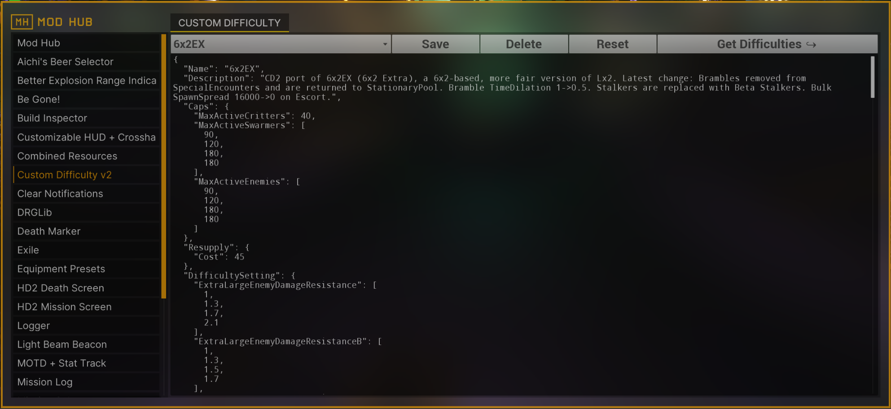

# Introduction

This document serves as a reference for Custom Difficulty 2, a mod for [Deep Rock Galactic](https://store.steampowered.com/app/548430/Deep_Rock_Galactic/) which allows the creation of new hazards, or difficulties. Developed by @TheBrain as a successor to the Custom Difficulty mod, CD2 features many improvements over the flexibility and possibilities offered to difficulty designers:

* Allows players to a have a much finer control over many aspects of the gameplay by introducing [mutators](mutators.md), control flow structures similar to those found in common programming languages. 
* Exposes many [enemy](enemies.md) controls to change their behaviour, spawning mechanics and even aspect by featuring custom materials replication to clients.
* Allows manipulating the enemy pools live during a mission based on gameplay conditions.
* Offers many features not available in CD1 such as controls for illumination, player scale, the amount of nitra in the map, etc.
* ... and many others.

## Main Sections

* [Basics](basics.md). The basics of CD2.
* [Modules](modules.md). A list of the top level modules for a valid CD2 file.
* [Enemies](enemies.md). Reference for the `Enemies` or `EnemiesNoSync` modules.
* [Wave Spawners](wavespawners.md). Reference for the `WaveSpawners` module.
* [Mutators](mutators.md). A list of currently supported mutators.
* [Tutorials](grouped_cooldowns.md). An assortment of small guides related to different CD2 topics.
* [Resources](resources.md). Useful links related to Custom Difficulty.

<figure markdown="span">
  
  <figcaption>Main CD2 screen in Modhub.</figcaption>
</figure>

## Update Log

* 4-Dec-2024: Updated for CD2-v9: added `ByEscortPhase` and `ByRefineryPhase` mutators.

