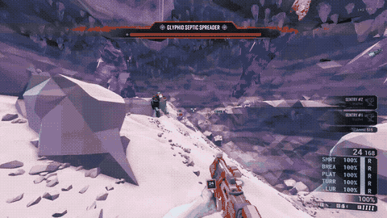

# Projectiles

`Projectile` is an optional field in enemy descriptors. It allows changing the projectiles of ranged enemies to any other projectile in the game. As an example, the following snippet produces a septic that throws driller's snowball:

```json
"ED_Ice_Septic": {
  "Base": "ED_Spider_Lobber",
  "Projectile": "PRJ_Crye_SnowBall_C",
}
```

<figure markdown="span">
  
</figure>

* This feature doesn't require `Enemies` and can use `EnemiesNoSync` instead so clients without CD2 can still see the changed projectiles.
* The name of the projectile can omit the "_C" at the end. 
* CD2 scans the game files for the projectiles so modders can add new ones themselves. Below the following list there is a section with the projectiles added by MEV and DEA, two common mods that add new enemies to the game. 
* The `Projectile` field can be mutated. 

## List of game projectiles

| Name |
| -------------------    | 
| "BP_Bosco_FoamGlob_C" |
| "BP_Bosco_Rocket_Frag_C" |
| "BP_Bosco_Rocket_Ice_C" |
| "BP_BoscoAbillityProjectile_C" |
| "BP_CameraDrone_FlareProjectile_C" |
| "BP_ClusterFragment_MicroMissileLauncher_C" |
| "BP_FoamRocket_C" |
| "BP_MicroRocket_Base_C" |
| "BP_MicroRocket_HE_C" |
| "PRJ_AcidDrop_C" |
| "PRJ_AcidDrop_Ice_C" |
| "PRJ_Base_Spider_Lobber_Projectile_C" |
| "PRJ_BaseBigGooProjectile_C" |
| "PRJ_BaseGooProjectile_C" |
| "PRJ_BaseNormalGooProjectile_C" |
| "PRJ_BigGoo_Buckshot_C" |
| "PRJ_BigGooProjectile_C" |
| "PRJ_BigGooProjectile_Trail_C" |
| "PRJ_Bomber_Fire_C" |
| "PRJ_BomberGoo_C" |
| "PRJ_BomberIce_C" |
| "PRJ_BombSpitter_C" |
| "PRJ_Boss_Twin_Stomp_C" |
| "PRJ_BreederEgg_C" |
| "PRJ_CactusSpike_C" |
| "PRJ_CaretakerBarrier_C" |
| "PRJ_ChargedBlasterShot_C" |
| "PRJ_Crawler_DeathProjectile2_C" |
| "PRJ_Crossbow_ChemicalExplosionProjecitle_C" |
| "PRJ_Crossbow_FireProjectile_C" |
| "PRJ_Crossbow_IceProjectile_C" |
| "PRJ_Crossbow_PheromoneProjectile_C" |
| "PRJ_Crossbow_Projectile_C" |
| "PRJ_Crossbow_TaserProjectile_C" |
| "PRJ_Crye_SnowBall_C" |
| "PRJ_Cryocannon_C" |
| "PRJ_DrippingPlant_C" |
| "PRJ_ExploderTankClusterBomb_C" |
| "PRJ_ExplosiveBombDrop_C" |
| "PRJ_Facility_Barrier_Base_C" |
| "PRJ_Facility_Laser_Base_C" |
| "PRJ_FacilityTentacleProjectile_C" |
| "PRJ_FacilityturretLaser_Burst_C" |
| "PRJ_FacilityTurretLaser_Sniper_C" |
| "PRJ_FlameWall_C" |
| "PRJ_FlareGun_Projectile01_C" |
| "PRJ_FlyingSmartRock_C" |
| "PRJ_Foam_C" |
| "PRJ_FriendlyInfectedMuleGrenade_C" |
| "PRJ_GooProjectile_Fragment_Base_C" |
| "PRJ_GooProjectile_Fragment_GooBomoberSpecial_C" |
| "PRJ_GooProjectile_Fragment_Normal_C" |
| "PRJ_Grenade_HackeShredder_C" |
| "PRJ_Grenade_StickySmall_C" |
| "PRJ_GrenadeAxe_C" |
| "PRJ_GrenadeLauncher_C" |
| "PRJ_GuntowerLineProjectile_C" |
| "PRJ_HomingDrone_C" |
| "PRJ_HydraWeed_Shooter_C" |
| "PRJ_HydraWeedSpawn_C" |
| "PRJ_HydraWeedSpawn_HealingPod_C" |
| "PRJ_InfectedMuleGrenade_C" |
| "PRJ_LargeStabbyThorn_C" |
| "PRJ_LineCutter2_C" |
| "PRJ_Mactera_Shooter_C" |
| "PRJ_Mactera_Shooter_Elite_C" |
| "PRJ_MicroMissile_Buck_C" |
| "PRJ_MicroMissile_C" |
| "PRJ_MicroMissile_Cluster_C" |
| "PRJ_MicroMissile_Dumbfire_C" |
| "PRJ_MicroMissile_Mine_Head_C" |
| "PRJ_MicroMissile_PlasmaBurster_C" |
| "PRJ_Mortar_Autocannon_C" |
| "PRJ_NormalBlasterShot_C" |
| "PRJ_NormalGooProjectile_C" |
| "PRJ_OmmoranEnergySprite_C" |
| "PRJ_PatrolBotLaser_Flying_C" |
| "PRJ_PatrolBotLaser_Flying_Hacked_C" |
| "PRJ_PatrolBotLaser_Hacked_C" |
| "PRJ_PatrolBotLaser_New_C" |
| "PRJ_PatrolBotRocket_C" |
| "PRJ_PlasmaCarbineShot_Big_C" |
| "PRJ_PlasmaCarbineShot_C" |
| "PRJ_PlatformMaker_C" |
| "PRJ_PowerupSphere_C" |
| "PRJ_ProjectileBarf_C" |
| "PRJ_RedThorn_C" |
| "PRJ_Rockpox_Breede_VomitedLarva_C" |
| "PRJ_Rockpox_Breeder_WormVomit_C" |
| "PRJ_Rockpox_PlagueGlob_C" |
| "PRJ_Rockpox_PlagueGlob_PlagueShark_C" |
| "PRJ_RockpoxBomber_PlagueDrop_C" |
| "PRJ_SentryOvercharge_Projectile_C" |
| "PRJ_ShootingPlant_C" |
| "PRJ_Spider_Boss_Heavy_C" |
| "PRJ_Spider_Boss_Heavy_FireballBallistics_C" |
| "PRJ_Spider_Boss_Twin_Mine_C" |
| "PRJ_Spider_Boss_Twin_Multifireball_C" |
| "PRJ_Spider_Lobber_Projectile_C" |
| "PRJ_Spider_Lobber_Projectile_Fragment_C" |
| "PRJ_Spider_RapidShooter_C" |
| "PRJ_Spider_Shooter_C" |
| "PRJ_Spider_Shooter_Ground_C" |
| "PRJ_Spider_Shooter_Queen_C" |
| "PRJ_Spider_Shooter_Rockpox_Plague_C" |
| "PRJ_Spider_Spitter_C" |
| "PRJ_Spider_Tank_Boss_C" |
| "PRJ_Spider_Tank_Boss_Eggshot_C" |
| "PRJ_StaticBomber_C" |
| "PRJ_TentaclePlant_New_C" |
| "PRJ_Terminator_Barrier_C" |
| "PRJ_TripleShooter_C" |
| "PRJ_Turret_Barrier_C" |
| "PRJ_WoodlouseAttack_C" |

## List of MEV projectiles 

To make use of these you will need to have MEV installed.

| Name |
| ---  |
| "PRJ_ExploderTankClusterBomb_Quacke_C" |
| "PRJ_FacilityTurretLaser_Sniper_Slow_C" |
| "PRJ_GrenadeLauncher_Hyper_C" |
| "PRJ_HydraWeed_Shooter_STE_C" |
| "PRJ_HydraWeed_Shooter_STE_web_C" |
| "PRJ_HydraWeed_Shooter_Sound_C" |
| "PRJ_HydraWeed_Shooter_Sound_Web_C" |
| "PRJ_Hyper2_C" |
| "PRJ_PatrolBotRocket_fast_C" |
| "PRJ_PatrolBotRocket_slow_C" |
| "PRJ_Roll2_C" |
| "PRJ_Roll_C" |
| "PRJ_Spawn_Enemy_C" |
| "PRJ_Spider_RapidShooter_Turbo_C" |
| "PRJ_Spider_RapidShooter_electric_C" |
| "PRJ_Spider_RapidShooter_fire_C" |
| "PRJ_Spider_RapidShooter_ice_C" |
| "PRJ_Spider_RapidShooter_poison_C" |
| "PRJ_SpitballerNukeEX_C" |
| "PRJ_SpitballerNuke_C" |
| "PRJ_TripleShooter_electric_C" |
| "PRJ_TripleShooter_fire_C" |
| "PRJ_TripleShooter_ice_C" |
| "PRJ_TripleShooter_poison_C" |
| "PRJ_WoodlouseAttack_electric_C" |
| "PRJ_WoodlouseAttack_fire_C" |
| "PRJ_WoodlouseAttack_ice_C" |
| "PRJ_WoodlouseAttack_poison_C" |

## List of DEA projectiles 

To make use of these you will need to have DEA installed. Comments by mod author @donnie_danko.

| Name | Comment | 
| ---- | ----- |
| PRJ_Spider_Spitter_Cyan | |
| PRJ_Spider_Spitter_White | |
| PRJ_Spider_Spitter_Pink | STE_MarkedForDeath_Spitter |
| PRJ_Spider_Spitter_Stagger | |
| PRJ_Fanatic_Fireball | All variants |
| PRJ_Ice_Shooter | |
| PRJ_RJ_Lobber | |
| PRJ_Sniper_Turret_Slow | |
| PRJ_Nukebomber_Bomb | |
| PRJ_Nukebomber_Shot | |
| PRJ_AcidBomber_Drop | |
| PRJ_AcidBomber_Shot | |
| PRJ_Spawninator_One_Meatball | |
| PRJ_Spawninator_Two_Meatball | |
| PRJ_Spawnshot | Used by _Slobber and _Shooter_Spawner |
| PRJ_Spawnshot_Dense | Used by _SlobberEX, _Shooter_SpawnerEX, and ShootingPlant_Spawner |
| PRJ_SpawnshotEX | Used by Fauxnought and ShootingPlant_SpawnerEX |
| PRJ_Exploder_SpawnShot | Used by Bomber_Exploder |
| PRJ_Exploder_SpawnShot_Baller | Used by ShootingPlant_Spawner_Boomer |
| PRJ_PheroShot and PRJ_SpawnDrop | Used by Parabomber |
| PRJ_Mactera_Breach | Used by Mactera_Brendle and Mactera_Brooter |
| PRJ_Spider_Tank_Boss | Used by Shooter_Fire | |
| PRJ_Spider_Shooter_Ground | Grooter and wall variant |
| PRJ_Spider_Shooter | Ceiling grooter |
| PRJ_Spider_Spitter | Gritters |

